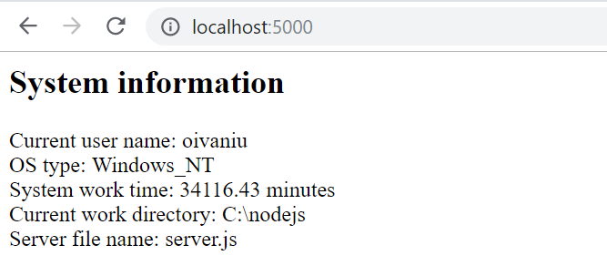
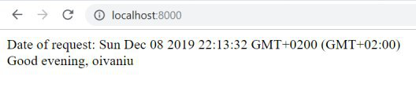

# Practical tasks 11

## **Task-1.** Створити `Node.js http-сервер`, який:

- слухатиме запити на порт `5000` на локальній машині;
- cервер повинен повертати сторінку, що містить:
  - ім’я поточного користувача операційної системи;
  - тип операційної системи;
  - час роботи системи в хвилинах
    > використати модуль [**OS**](https://nodejs.org/api/os.html)
  - поточну робочу директорію;
  - назву файлу сервера;
    > використати модуль [**path**](https://nodejs.org/dist/latest-v10.x/docs/api/path.html)

---

## **Task-2.** Необхідно створити власний модуль `personalmodule.js`, який:

- містить функцію, що:
  - приймає ім’я системного юзера;
  - працює з поточним часом;
  - на основі пори доби виводить повідомлення із привітанням юзера;

> Щоб експортувати змінні чи функції модуля на зовні можна використати об’єкт [**module.exports**](https://nodejsdev.ru/doc/modules/).

- cтворіть `Node.js` сервер, який:
  - з використанням функціоналу розробленого модуля повертатиме наступну сторінку:

---
