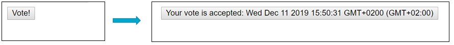
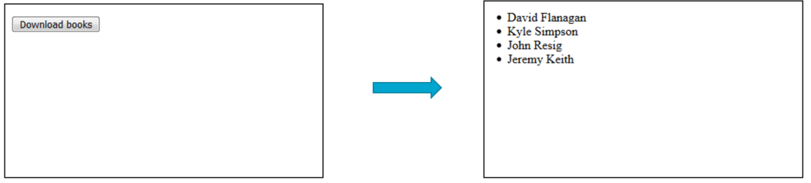

# Practical tasks 12

## **Task-1.** На основі `AJAX` технології напишіть клієнтську частину аплікації (`HTML+JavaScript`), в якій:

- при натисненні на кнопку надсилається асинхронний `GET`-запит на сервер, сервер обробляє запит і надсилає його на `HTML`-сторінку оновлюючи вміст кнопки так як показано в прикладі:

## **Task-2.** На основі `AJAX` технології напишіть клієнтську частину аплікації (`HTML+JavaScript`), в якій:

- при натисненні на кнопку надсилається асинхронний `GET`-запит на сервер;
- завантажується файл *books.json*;
- з нього виводяться всі назви авторів у вигляді списку на `HTML`-сторінку;

