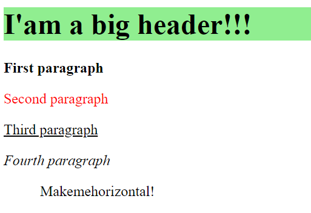

# Practical tasks 6

## **Task-1.** На `HTML`-сторінці є елемент `div`:

    <body>
      
First

    </body>

- потрібно змінити вміст елемента із First на Last;
- доступіться до елемента div хоча б 2 способами;

---

## **Task-2.** На сторінці є елемент зображення:

    <body>
      
    </body>

- потрібно змінити зображення dog.jpg на cat.jpg;
- виведіть в модальному вікні вміст тегу img з новим зображенням;

---

## **Task-3.** На вказаній `HTML`-сторінці:

    <body>
      <h2>Article header</h2>
        

          
First paragraph

          
Second paragraph

          
Third paragraph

        

      
Another text

    </body>

- необхідно отримати всі елементи всередині тега div по селектору (використати метод `document.querySelectorAll`);
- вивести їх вміст із вказанням номеру абзацу в такому форматі:

      Selector text 0: First paragraph
      Selector text 1: Second paragraph
      Selector text 2: Third paragraph

---

## **Task-4.** На HTML-сторінці є ненумерований список з id="list", який складається із 5 елементів.

У модальному вікні необхідно послідовно вивести вміст:

1. першого елемента списку;
2. останнього елемента списку;
3. другого елемента списку;
4. четвертого елемента списку;
5. третього елемента списку;

**Зробіть завдання 2 різними способами.**

**Приклад:**

    •	1
    •	2
    •	3
    •	4
    •	5

**Результат виводу:** 1, 5, 2, 4, 3

---

## **Task-5.** Для сторінки:

    <body>
          <h1>I'am a big header!!!</h1>
      

          
First paragraph

          
Second paragraph

          
Third paragraph

          
Fourth paragraph

      

      <ul id="myList">
          <li>Make</li>
          <li>me</li>
          <li>horizontal!</li>
      </ul>
      Make me invisible, please!
    </body>

**Напишіть скріпт, який за допомогою засобів `DOM` простилізує сторінку так як показано нижче:**

---

## **Task-6.** Задано `HTML`-сторінку:

    <body>
      <input type="text" id="input1" value="Text1">
      <input type="text" id="input2" value="Text2">
    </body>

- користувач почергово вводить 2 повідомлення (використати `prompt()`).
- 1-е повідомлення записується в 1-ий `<input>`;
- 2-ге повідомлення записується в 2-ий `<input>`;
- поміняти значення 1-го і 2-го інпутів місцями;

---

## **Task-7.** Напишіть **скріпт**, який за допомогою засобів `DOM` створить для порожньої `HTML`-сторінки таку структуру з тегів і їх атрибутів:

    <body>
      <main class="mainClass check item">
        

          
First paragraph

        

      </main>
    </body>

---
