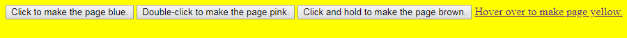
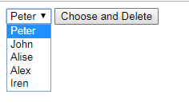
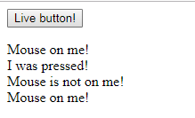
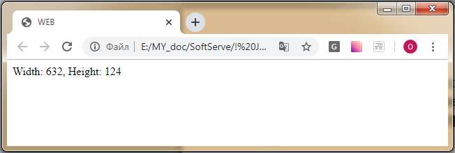
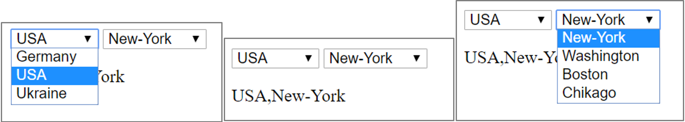

# Practical tasks 7

## **Task-1.** За допомогою методів об’єкта `window` створити:

1. нове вікно розміром 300х300 пікселів;
2. із затримкою 2 сек змініть розміри вікна на 500х500 пікселів;
3. із затримкою 2 сек перемістіть вікно в точку з координатами (200, 200);
4. із затримкою 2 сек закрийте вікно;

---

## **Task-2.** Для заданої `HTML`-сторінки:

    
I learning JavaScript events!

    

      <button . . . . . >Change style!</button>
    

- напишіть функцію `changeCSS()`, яка:
  - спрацьовуватиме по кліку на кнопку;
  - змінюватиме стиль вмісту тега `
`:
    - колір шрифту – помаранчевий;
    - розмір шрифту _20px_;
    - шрифт сімейства _"Comic Sans MS"_

---

## **Task-3.** Задано сторінку з 3 кнопками і 1 лінкою.

- Напишіть `Javascript` код і реалізуйте `HTML`-сторінку з відповідними подіями на кожному елементові:
  - 1-ша кнопка – при кліку на неї колір фону сторінки міняється на синій;
  - 2-га кнопка – при подвійному кліку на неї колір фону сторінки міняється на рожевий;
  - 3-я кнопка – при натисненні і утримуванні кнопки колір фону сторінки стає коричневий. При відпусканні – білий;
  - При наведенні на лінку – колір фону стає жовтим, при відведенні – білим;

Приклад – курсор наведений на лінку:

---

## **Task-4.** Реалізуйте програму, яка:

- по натисканню на кнопку видалятиме обраний елемент випадаючого списку;

**_Можуть видалятися всі елементи в будь-якому порядку._**

---

## **Task-5.** Реалізуйте програму, яка:

- по натисканню на кнопку виводитиме повідомлення
  _"I was pressed!"_;
- при наведенні на кнопку виводитиме повідомлення _"Mouse on me!"_;
- при відведенні курсора миші виводитиме повідомлення _"Mouse is not on me!"_;

Приклад роботи:

---

## **Task-6.** Реалізуйте програму, яка:

- відслідковуватиме зміну розміру (ширини і висоти) вікна браузера;
- виводитиме на поточну сторінку при її розтязі/стисканні відповідні значення;

---

## **Task-7.** На сторінці потрібно реалізувати 2 випадаючих списки.

- у першому містяться назви країн;
- у другому – назви міст;

**Код `HTML`-сторінки:**

    <select name="country" id="country">
      <option value="ger">Germany</option>
      <option value="usa">USA</option>
      <option value="ukr">Ukraine</option>
    </select>

    <select name="cities" id="cities"></select>
    

### Реалізувати роботу таким чином, щоб:

- коли вибирається з лівого випадаючого списку певна країна - в правому випадаючому списку з'являлися міста цієї країни;
- cписок міст формується динамічно, через `JavaScript`;
- потрібно нижче вивести назву обраної країни і місто;

